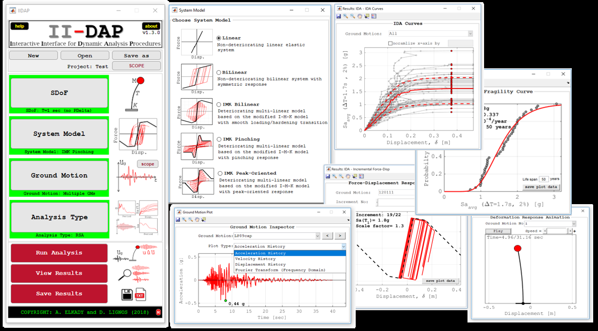

  

------------

## II-DAP
IIDAP is a standalone MATLAB-based software capable of performing a variety of dynamic analysis procedures ranging from simple response history analysis to response spectrum and incremental dynamic analyses on single degree-of-freedom systems (SDoF). IIDAP includes a wide-ranging library of SDoF system models ranging from simple non-deteriorating linear and bilinear models to state-of-the-art deteriorating bilinear pinched and peak-oriented responses. A seismic hazard module is also included for the quantification of collapse risk. IIDAP is highly beneficial for both educational and research purposes.

Tutorial videos can be found at this YouTube [playlist](https://www.youtube.com/playlist?list=PLz_XdUL-6Y_lqvBanzTFuFNB9K3xDzXAi)

--> Last update: 25 October 2021

## Citation
Elkady, A. and Lignos, D.G. (2019). "II-DAP: Interactive Interface for Dynamic Analysis Procedures" Version 1.3.0. Zenodo. http://doi.org/10.5281/zenodo.3405558
